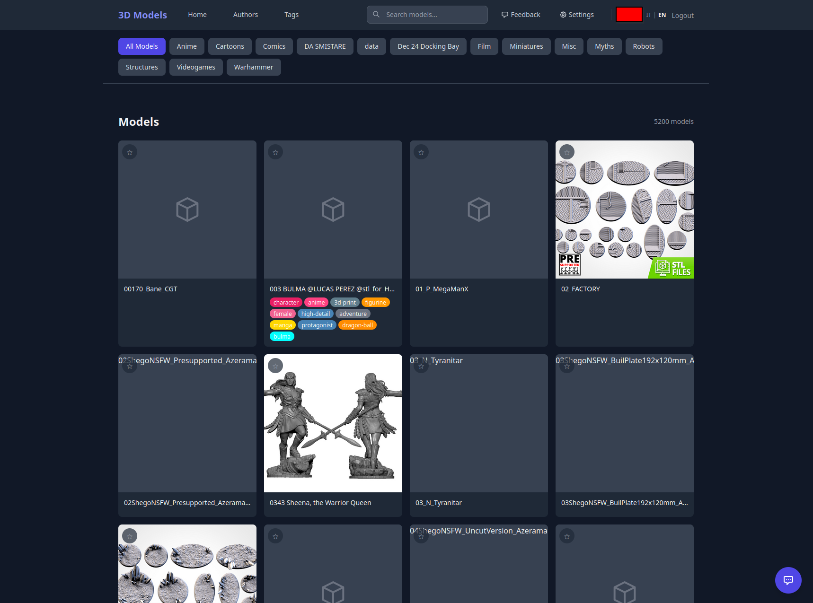
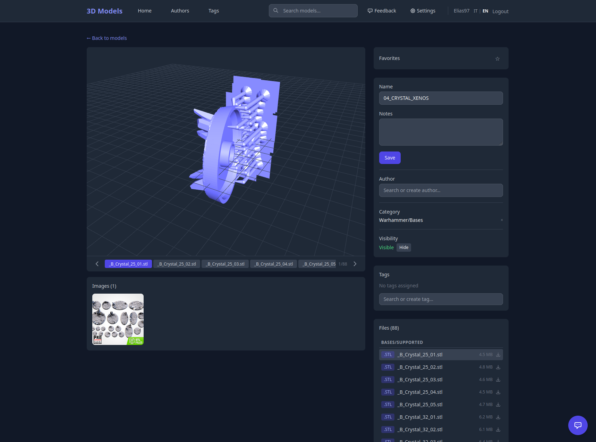
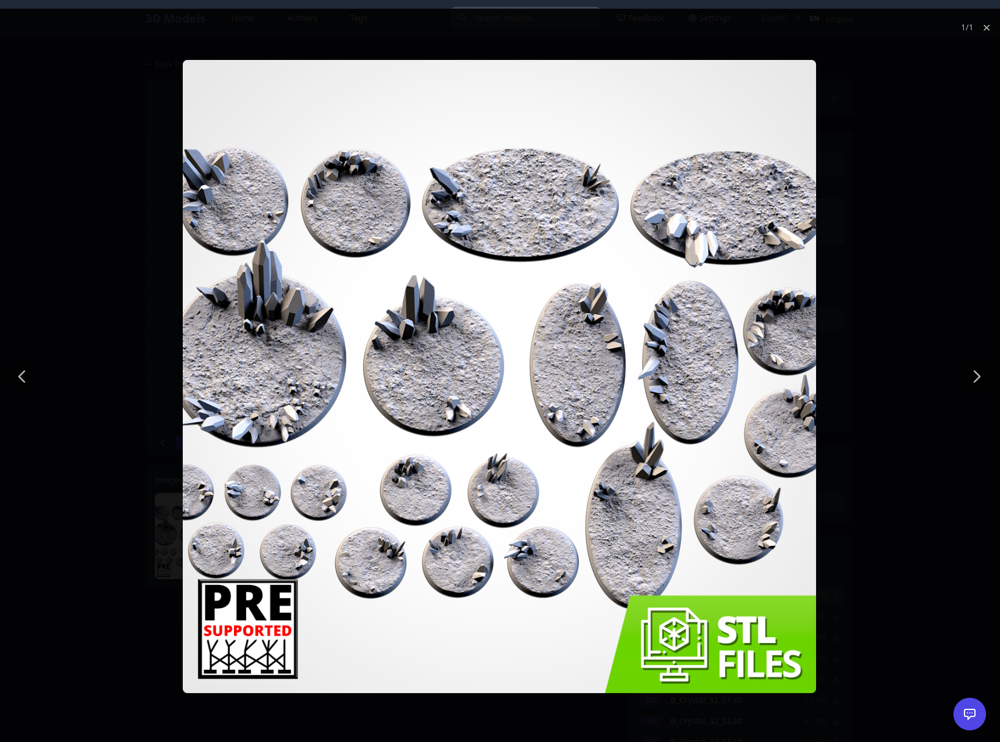
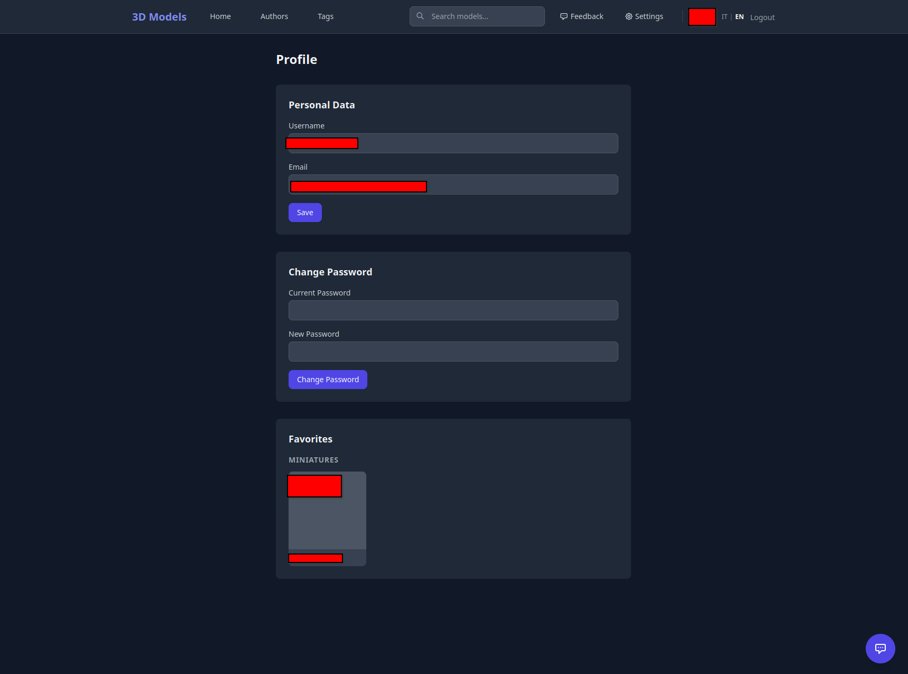
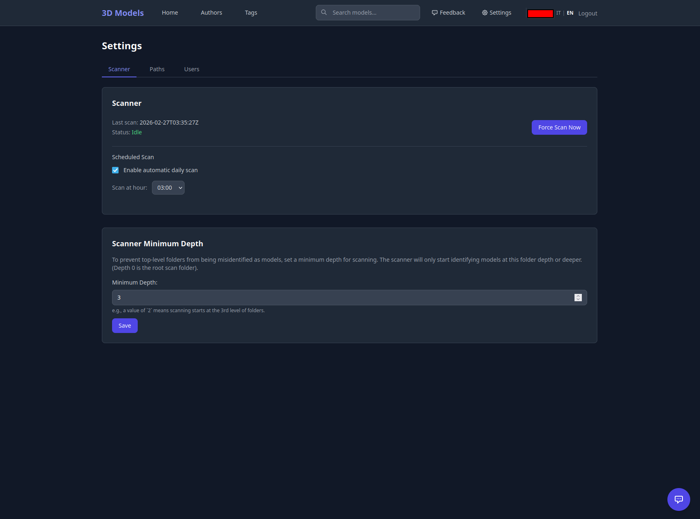
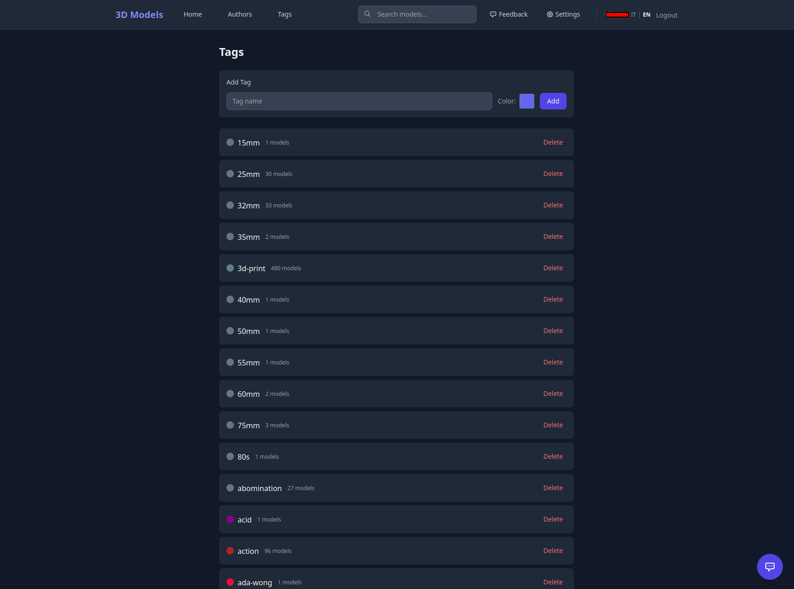

# 3D Models Categorization

A self-hosted web application for cataloging, browsing, and managing large collections of 3D model files. It automatically scans your filesystem to discover models, organizes them into categories, and provides a rich UI with full-text search, tagging, an integrated 3D viewer, and more.


---

*[Leggi in italiano](docs/guide/README.it.md)*

## Screenshots

| Home | Model Detail | 3D Viewer |
|------|-------------|-----------|
|  |  |  |

| Profile | Settings | Tags |
|---------|----------|------|
|  |  |  |

## Features

- **Automatic filesystem scanning** — recursively discovers 3D model directories with configurable detection rules
- **Full-text search** — PostgreSQL TSVECTOR with GIN index for fast prefix-matching queries
- **Hierarchical categories** — auto-generated from directory structure with recursive filtering
- **Tagging system** — colored tags with multi-tag intersection filtering
- **Author tracking** — associate models with creators/sources
- **Built-in 3D viewer** — renders STL and OBJ files in the browser via Three.js
- **Image gallery** — discovers and displays reference images with lightbox viewer
- **User favorites** — per-user favorite models grouped by category on the profile page
- **Model merging** — transactional merge of duplicate models
- **Feedback system** — users can submit feedback; admins manage it with status tracking
- **Multi-language UI** — Italian (default) and English, switchable from the navbar
- **JWT authentication** — role-based access control (Admin / User)
- **Scheduled scans** — automatic daily scans at a configurable hour
- **Dark-themed UI** — responsive design with Tailwind CSS and HTMX-driven partial updates
- **No CGO required** — uses the pure-Go `pgx` driver for PostgreSQL

## Tech Stack

| Layer | Technology |
|-------|-----------|
| Language | Go |
| Router | [chi](https://github.com/go-chi/chi) v5 |
| Database | PostgreSQL (via [pgx](https://github.com/jackc/pgx) v5) |
| Templates | [Templ](https://templ.guide/) |
| Frontend | HTMX + Tailwind CSS (CDN) |
| 3D Viewer | Three.js (CDN) |
| Auth | JWT ([golang-jwt](https://github.com/golang-jwt/jwt)) |
| Config | [godotenv](https://github.com/joho/godotenv) |

## Quick Start

### Prerequisites

- **Go 1.25+**
- **PostgreSQL 15+**
- **[Templ CLI](https://templ.guide/quick-start/installation)** — `go install github.com/a-h/templ/cmd/templ@latest`

### 1. Clone and configure

```bash
git clone https://github.com/your-username/3DModelsCategorization.git
cd 3DModelsCategorization
```

Create a `.env` file:

```env
SCAN_PATH=/path/to/your/3d-models
PORT=8080

DB_HOST=localhost
DB_PORT=5432
DB_USER=postgres
DB_PASSWORD=your_password
DB_NAME=models3d
DB_SSLMODE=disable
```

### 2. Create the database

```sql
CREATE DATABASE models3d;
```

All tables, indexes, and triggers are applied automatically on first startup.

### 3. Build and run

```bash
make build    # Generate templ templates + compile
make run      # Build and start the server
```

Open `http://localhost:8080`. On first launch you'll be prompted to create an admin account.

## Build Commands

| Command | Description |
|---------|-------------|
| `make build` | Generate templ templates and compile the Go binary |
| `make run` | Build and start the application |
| `make generate` | Run `templ generate ./...` only |
| `make clean` | Remove the binary and generated `*_templ.go` files |

## Documentation

For detailed documentation on architecture, scanner logic, API endpoints, database schema, and more:

- **[Full Documentation (English)](docs/guide/README.en.md)**
- **[Documentazione completa (Italiano)](docs/guide/README.it.md)**

## Project Structure

```
.
├── main.go                          # Entry point
├── Makefile                         # Build automation
├── .env                             # Configuration (not committed)
├── internal/
│   ├── config/                      # Environment config loader
│   ├── models/                      # Data structures
│   ├── database/                    # PostgreSQL connection + migrations
│   ├── repository/                  # Data access layer
│   ├── scanner/                     # Filesystem scanner + scheduler
│   ├── handlers/                    # HTTP handlers
│   ├── middleware/                   # JWT auth middleware
│   └── i18n/                        # Internationalization (IT/EN)
│       └── locales/                 # JSON translation files
├── templates/                       # Templ components (flat package)
├── static/
│   ├── css/app.css                  # Custom styles
│   └── js/viewer3d.js               # Three.js STL/OBJ viewer
└── docs/                            # Documentation and changelogs
    ├── guide/                       # User & developer guides (EN/IT)
    └── imgs/                        # Screenshots
```

## License

*(Add your license here.)*
